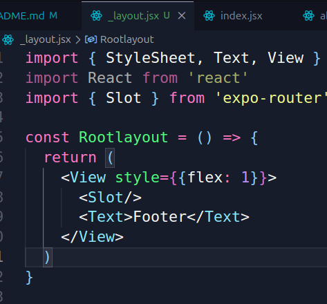

# React Native + expo app

## Setup & Installation

### Setting Up the template and installing all necessary files
```bash
npx create-expo-app@latest --template blank .
```

### Starting the Project

```bash
npx expo start
```

### File structure setup

- Step 1: Delete `index.js` & `App.js`.
- Step 2: Create `app/index.js` in the root of the project.
- Step 3: Now, in that file create a boilerplate using `rnfes` snippet.

## Working on the project.

- Every `jsx/tsx` file  created within `app` will automaticly have the routing power.
- We can also use built-in `<Link>` component of `expo-router` to visit from one page to another.
    ```javascript
    import { Link } from "expo-router";
    ```

## Layouts and Stacks

- Can use `<Slot />` before the desired component that I want to keep active for all the pages inside the `/_layout.jsx` file.



- But if we want features like, trace back to previous page and other advanced functionality, we can use `<Stack />` in the same manner as `<Slot />`.
- If we want more customization, we can also use `<Stack></ Stack>`


## Acknowledgement

- [Net ninja - Youtube Playlist](https://www.youtube.com/playlist?list=PL4cUxeGkcC9hNTz3sxqGTfxAwU-DIHJd2)